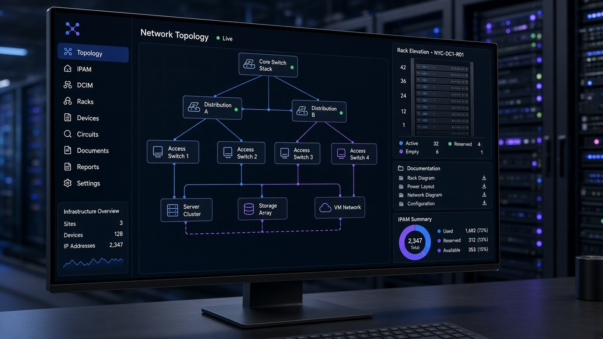
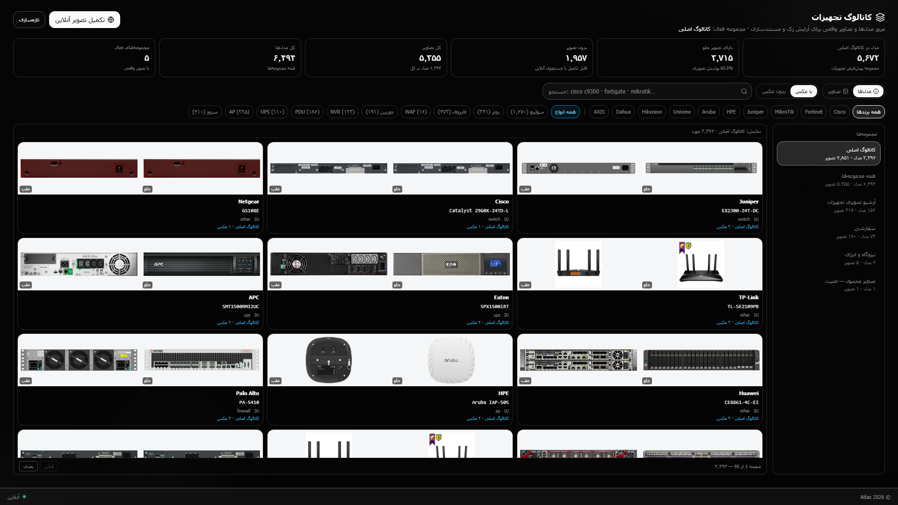
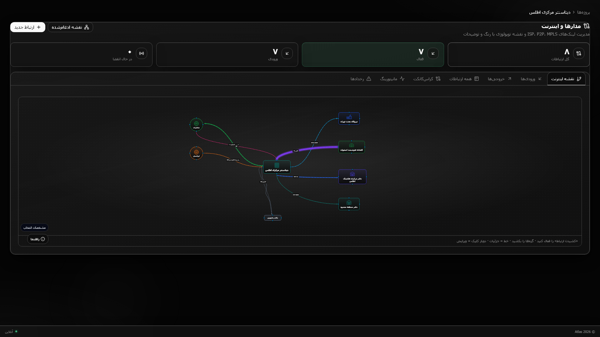

# Atlas

**DCIM · IPAM · NMS** — interactive public catalog for a large on‑prem infrastructure platform

  

  

<a href="https://ramincsy.github.io/atlas-showcase/"><b>https://ramincsy.github.io/atlas-showcase/</b></a>

  
  

> **Demo first:** the live product window is on **GitHub Pages** (click‑to‑zoom lightbox). This repo is a public catalog only — implementation stays private.

---

## Live catalog (GitHub Pages)

| | |
|:--|:--|
| **Open demo** | [ramincsy.github.io/atlas-showcase](https://ramincsy.github.io/atlas-showcase/) |
| What you get | Interactive gallery — story strip, capability groups, click‑to‑zoom |
| Controls | Click any shot · ← → · Esc |

---

## Preview

  

<b><a href="https://ramincsy.github.io/atlas-showcase/">Open the interactive catalog →</a></b>

| DCIM 3D | Topology | IPAM |
|:---:|:---:|:---:|
|  |  |  |

| Monitoring | Catalog | Circuits |
|:---:|:---:|:---:|
|  |  |  |

---

## What Atlas is

On‑prem Persian/RTL platform for multi‑site **datacenter + network** operations: 3D DCIM, IPAM, discovery, SNMP monitoring, WAN circuits, and a large equipment model library.

Surfaces in the live catalog: **DCIM · Network · IPAM · Power · Ops · Catalog**

---

### فارسی

این مخزن فقط یک <b>کاتالوگ عمومی</b> از رابط Atlas است. برای دیدن دموی تعاملی (زوم، گالری و تور محصول) به GitHub Pages بروید:

<a href="https://ramincsy.github.io/atlas-showcase/"><b>مشاهده کاتالوگ زنده Atlas</b></a>

Atlas یک سامانهٔ سازمانی زیرساخت و شبکه است (DCIM، IPAM، مانیتورینگ و عملیات چندسایته). سورس و جزئیات پیاده‌سازی در این مخزن منتشر نمی‌شود.

---

**Contact:** [ramioo.com](https://www.ramioo.com) · [ramincsywork@gmail.com](mailto:ramincsywork@gmail.com) · [0914 666 50 68](tel:+989146665068)

© ramioo
